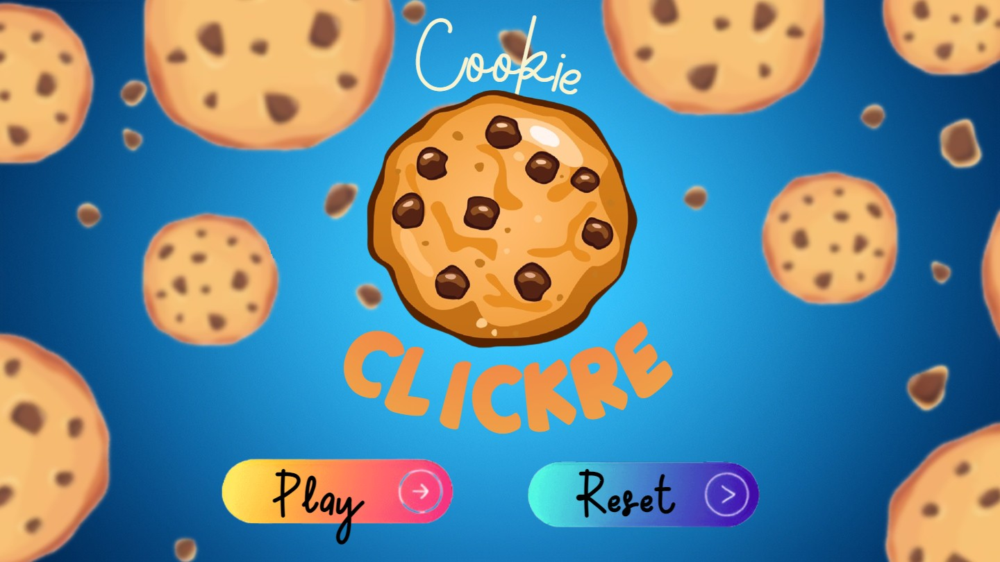
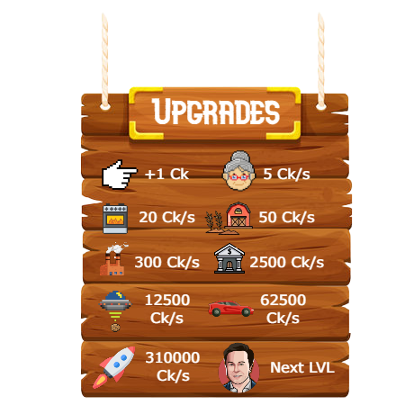
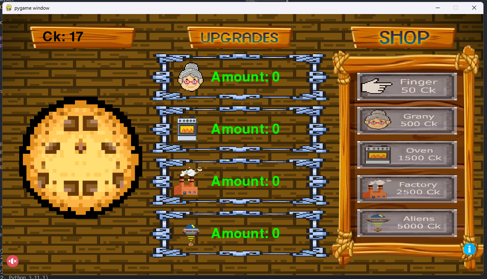

# Cookie Clicker

Welcome to Cookie Clicker! This is a simple and addictive idle clicking game where your goal is to click as many cookies as possible. Click your way to cookie glory and become the ultimate cookie clicker!

Press p to play and r to reset the Cookie Score

# How to paly

Click the Cookie: The main objective of the game is to click on the giant cookie as fast as you can. Each click earns you a certain number of cookies. Clicking repeatedly will quickly increase your cookie count.

Upgrade Your Cookie Production: As you accumulate cookies, you can spend them on upgrades to boost your cookie production. There are five upgrades available:

    Finger: Purchase the Finger upgrade to increase your cookie output by +2 cookies per click. This means that each time you click the cookie, you will earn an additional 2 cookies.

    Granny: The Granny upgrade increases your cookie production by +10 cookie per second (cps). This passive increase allows you to earn more cookies even when you're not actively clicking.

    Oven: With the Oven upgrade, your cookie production increases by +15 cps. This upgrade will significantly boost your cookie production rate, allowing you to accumulate cookies more quickly.

    Factory: The Factory upgrade further enhances your cookie production with a boost of +20 cps. This upgrade is more powerful than the Oven and will help you generate cookies at an even faster rate.

    Alien: The Alien upgrade is the most potent of all. It provides a massive boost of +40 cps to your cookie production. Purchasing this upgrade will skyrocket your cookie output and bring you closer to becoming a cookie clicker legend!

[Licese](LICENSE)